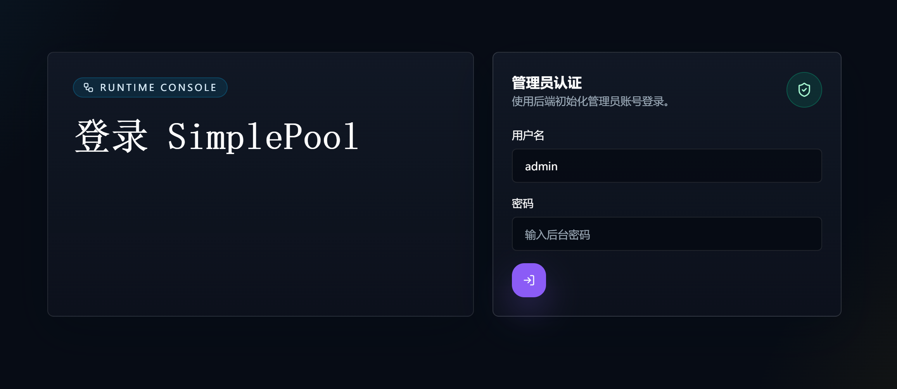
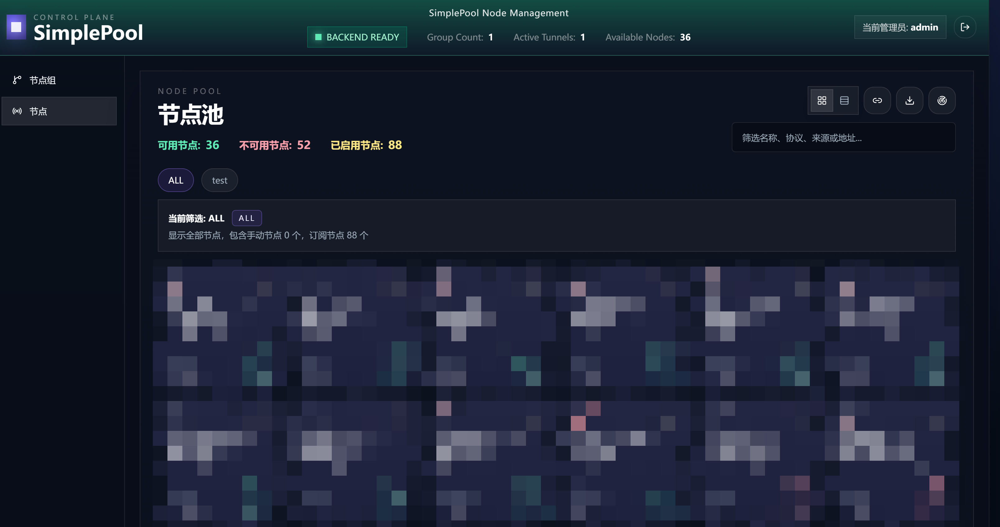

# SimplePool

[English](./README.md)

SimplePool 底层基于 `sing-box`，是一个围绕“先分组、后建隧道”设计的代理池。你先用正则规则把节点筛进不同的组里，再从组内动态创建 HTTP 隧道；隧道启动后会锁定一个节点，只有在你手动刷新时才切到新的可用节点。

这个项目的出发点很直接：有些场景不是“每个请求挑一个最快节点”，而是“一个完整 workflow 从头到尾都要稳定走同一个节点”。相比 Clash 常见的负载均衡策略，SimplePool 允许你在组内启用或禁用节点、按需刷新当前隧道节点，并把一次任务稳定绑定在同一个出口上，直到你明确要求切换。

## 截图

| 登录页 | 节点池 |
| --- | --- |
|  |  |

## 核心特性

- 单个后端二进制直接托管嵌入式 React Web UI。
- 同时支持手动节点、批量导入和订阅源。
- 先按组筛选节点，再从组内动态创建 HTTP 隧道。
- 每个 HTTP 隧道对应一个独立嵌入式 `sing-box` runtime，并稳定锁定当前节点。
- 节点支持启用 / 禁用，隧道支持手动刷新到新的可用节点。
- 比按请求分流的策略更适合需要“整段流程固定同一出口”的场景。
- 使用 SQLite 持久化状态，敏感凭据加密保存，并记录隧道事件历史。
- 以 `-debug` 启动时可暴露 OpenAPI JSON 便于调试和集成。

## 项目边界

- 仅支持 HTTP 隧道。
- 仅面向单管理员、单机、自托管部署。
- 不做多租户调度。
- 不做自动故障切换。
- 不做周期性自动切优。

## 快速开始

### 环境要求

- `Go 1.25.6`
- `Node.js 22.12.0`
- `npm`
- 推荐使用 `mise` 管理工具链

### 安装依赖

```bash
git clone https://github.com/WAY29/SimplePool
cd SimplePool
mise install
npm --prefix web install
cp .env.example .env
```

### 配置环境变量

启动前先编辑 `.env`。

- `SIMPLEPOOL_ADMIN_PASSWORD` 必填。
- `SIMPLEPOOL_MASTER_KEY` 与 `SIMPLEPOOL_MASTER_KEY_FILE` 二选一，不能同时设置。
- `.env.example` 中的主密钥仅用于本地演示，真实使用前必须替换。
- `SIMPLEPOOL_LOG_LEVEL` 同时控制 SimplePool 自身日志和嵌入式 `sing-box` runtime 日志，包括各隧道的 `stdout.log` 与 `stderr.log`。
- 默认监听地址为 `127.0.0.1:7891`。

### 构建嵌入式前端并启动服务

```bash
mise run web:build
go run -tags 'with_quic with_dhcp with_wireguard with_clash_api' ./cmd/simplepool-api --config .env
```

启动后直接访问 `http://127.0.0.1:7891`。

如果要暴露 `openapi.json`，请使用调试模式启动：

```bash
go run -tags 'with_quic with_dhcp with_wireguard with_clash_api' ./cmd/simplepool-api --config .env -debug
```

### 构建发行二进制

```bash
mise run build
./simplepool --config .env
```

## 使用方式

1. 使用配置文件中的管理员账号登录。
2. 添加手动节点、导入分享内容，或创建订阅源。
3. 用正则规则创建节点组，定义隧道候选池。
4. 基于某个组创建 HTTP 隧道，由系统挑选一个可用节点。
5. 通过 `Refresh` 重新锁定节点，或用 `Start` / `Stop` 管理隧道 runtime。

基础健康检查：

```bash
curl http://127.0.0.1:7891/healthz
```

最小登录示例：

```bash
curl \
  -X POST http://127.0.0.1:7891/api/auth/login \
  -H 'Content-Type: application/json' \
  -d '{"username":"admin","password":"change-me"}'
```

## 文档

- [架构设计](./docs/ARCHITECTURE.md)
- [开发约定](./docs/DEVELOPMENT.md)
- [仓库内 OpenAPI JSON](./internal/httpapi/openapi/openapi.json)
- 运行时接口：使用 `-debug` 启动后可访问 `GET /openapi.json`

## 参与贡献

欢迎提交 Issue 和 Pull Request。

建议在本地至少执行以下检查：

```bash
mise run check
npm --prefix web run test
```

如果只调前端，请先保持后端运行在 `127.0.0.1:7891`，再在另一个终端启动 Vite：

```bash
npm --prefix web run dev
```

## 开源协议

[GNU General Public License v3.0 or later](./LICENSE)
